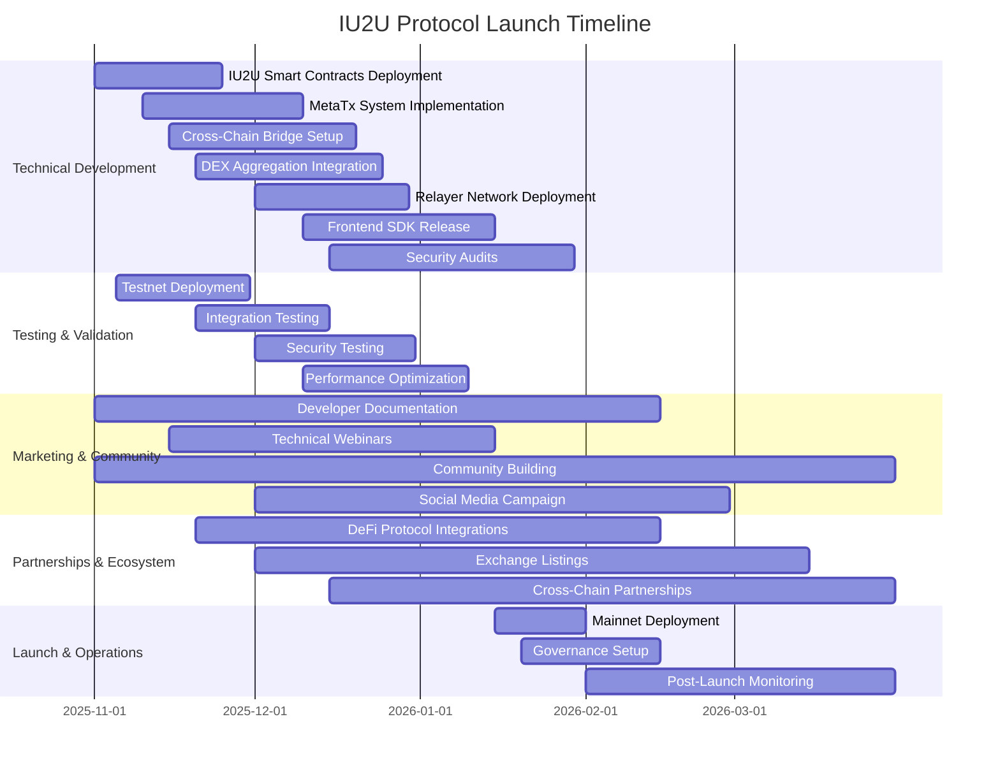
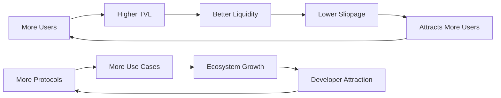

# IU2U Protocol - Go-to-Market Strategy

<div align="center">
    
</div>

## 🎯 Executive Summary

**IU2U Protocol** represents a paradigm shift in cross-chain interoperability, introducing gasless meta-transactions powered by U2U tokens across 8+ EVM-compatible chains. Our Go-to-Market strategy focuses on establishing IU2U as the leading cross-chain infrastructure protocol through strategic launches, accelerated growth, and key partnerships.

### Market Opportunity
- **Total Addressable Market (TAM)**: $50B+ cross-chain DeFi market, $1.76 trillion for DeFi spot trading volume
- **Serviceable Addressable Market (SAM)**: $18B+ DEX aggregation and bridge solutions, $412B monthly trading volue 
- **Serviceable Obtainable Market (SOM)**: $500M+ ~ $2B target market share by 2026

---

## 🚀 Phase 1: Strategic Launch (Months 1-6)

### 1.1 Pre-Launch Foundation (Month 1-2)

#### Technical Readiness
- ✅ **Smart Contract Audits**
- ✅ **Multi-Chain Deployment** (8 supported networks)
- ✅ **Relayer Infrastructure** (GMP + Meta-Transaction relayers)
- ✅ **Security Testing** (Bug bounty program: $50K-$100K rewards)

#### Go-to-Market Assets
- **Developer Documentation** (API reference, integration guides)
- **Technical Whitepapers** (Cross-chain architecture, tokenomics)
- **Case Studies** (Integration examples, performance benchmarks)
- **Community Resources** (Discord, Telegram, developer forums)

#### Regulatory Compliance
- **Legal Framework** analysis across target jurisdictions
- **Token Classification** compliance (utility token positioning)
- **Privacy Policy** and **Terms of Service** finalization
- **Know Your Customer (KYC)** compliance for institutional partnerships

### 1.2 Alpha Launch - Testnet (Month 2-3)

#### Target Audience: Core Developers & Early Adopters
- **50+ DeFi protocols** for integration testing
- **100+ developers** in private alpha program
- **10+ institutional partners** for enterprise validation

#### Launch Activities


#### Success Metrics
- **500+ testnet transactions** per day
- **25+ protocol integrations** (lending, DEX, yield farming)
- **99%+ uptime** for relayer infrastructure
- **<30 seconds** average cross-chain transaction time

### 1.3 Beta Launch - Mainnet (Month 3-4)

#### Limited Mainnet Deployment
- **Ethereum, BSC, Base, Polygon, Arbitrum, Optimism, Avalanche + U2U** initial launch
- **$1M TVL** target within 3 months
- **10K+ unique addresses** interaction goal
- **50+ DApps** integrated or planning integration

#### Marketing Campaign: "Cross-Chain Made Simple"
- **Content Marketing**: Technical blogs, video tutorials
- **Developer Relations**: Workshops, conference sponsorships
- **Influencer Partnerships**: Crypto KOLs, DeFi thought leaders
- **PR Strategy**: Tech media coverage, protocol announcements

#### Risk Mitigation
- **Gradual TVL Scaling** ($100K → $1M → $10M progression)
- **Emergency Response** procedures and pausability
- **Insurance Coverage** for smart contract risks
- **24/7 Monitoring** and incident response team

### 1.4 Full Production Launch (Month 4-6)

#### Multi-Chain Expansion
| Network | Launch Week | Target TVL | Key Partnerships |
|---------|-------------|------------|------------------|
| U2U + Ethereum | Week 1 | $1M | Uniswap, Aave |
| BSC + Polygon | Week 3 | $5M | PancakeSwap, Compound |
| Avalanche + Arbitrum | Week 6 | $10M | TraderJoe, GMX |
| Optimism + Base | Week 9 | $25M | Velodrome, Aerodrome |

#### Launch Event Strategy
- **Virtual Launch Conference** (2-day event)
- **Live Trading Competition** ($50K prize pool)
- **Developer Workshop Series** (integration bootcamps)
- **Community Token Distribution** (early adopter rewards)

---

## 📈 Phase 2: Accelerated Growth (Months 6-18)

### 2.1 Market Penetration Strategy

#### Product-Market Fit Optimization
- **User Journey Analysis** (onboarding → retention optimization)
- **Feature Usage Analytics** (most/least used functionalities)
- **Performance Benchmarking** (vs. competitors like LayerZero, Axelar)
- **Cost Efficiency Metrics** (gas savings quantification)

#### Target Segments Expansion

##### 🎯 Segment 1: DeFi Power Users
- **Profile**: >$50K DeFi portfolio, multi-chain active users
- **Pain Points**: High gas fees, complex bridging, fragmented liquidity
- **IU2U Solution**: Gasless transactions, unified U2U gas token
- **Acquisition**: DeFi yield optimization tools, gas fee calculators

##### 🎯 Segment 2: DeFi Protocols
- **Profile**: DEXs, lending protocols, yield aggregators
- **Pain Points**: Limited cross-chain functionality, high integration costs
- **IU2U Solution**: Simple IU2UExecutable inheritance, 37+ DEX access
- **Acquisition**: Technical partnerships, revenue sharing models

##### 🎯 Segment 3: Institutional Traders
- **Profile**: Trading firms, market makers, institutional DeFi
- **Pain Points**: Slippage, MEV attacks, operational complexity
- **IU2U Solution**: Optimal routing, MEV protection, unified API
- **Acquisition**: White-label solutions, dedicated support

### 2.2 Growth Engine Development

#### Network Effects Strategy


#### User Acquisition Channels

##### 📱 Digital Marketing
- **Google Ads**: Targeting "cross-chain bridge," "DeFi aggregator" keywords
- **Twitter/X Marketing**: Technical threads, protocol updates, ecosystem news
- **YouTube Strategy**: Educational content, integration tutorials
- **Podcast Sponsorships**: "The Defiant," "Unchained," "Bankless"

##### 🤝 Partnership Marketing
- **DeFi Protocol Integrations**: Co-marketing campaigns
- **Wallet Partnerships**: MetaMask, WalletConnect, Coinbase Wallet
- **Educational Platforms**: Bankless Academy, DeFi Pulse, CoinGecko

##### 🎓 Developer Relations
- **Hackathon Sponsorships**: ETHGlobal, Gitcoin, DoraHacks
- **Conference Presence**: DevCon, EthCC, DeFi Summit
- **Grant Programs**: $500K+ developer incentive fund
- **Documentation**: Comprehensive guides, video tutorials, sample code

#### Retention & Engagement

##### User Retention Tactics
- **Loyalty Program**: U2U rewards for frequent users
- **Gamification**: Trading challenges, leaderboards
- **Educational Content**: DeFi strategies, cross-chain tutorials
- **Community Events**: AMAs, trading competitions

##### Protocol Retention
- **Revenue Sharing**: Fee distribution to integrated protocols
- **Technical Support**: Dedicated integration assistance
- **Co-Development**: Feature requests and custom solutions
- **Marketing Support**: Joint announcements, case studies

### 2.3 Ecosystem Development

#### Developer Ecosystem
- **SDK Enhancement**: Multi-language support (JavaScript, Python, Go)
- **Integration Templates**: Pre-built smart contract modules
- **Testing Framework**: Cross-chain simulation environment
- **Developer Grants**: $1M+ fund for innovative integrations

#### Institutional Infrastructure
- **Enterprise API**: Higher rate limits, custom endpoints
- **Institutional Support**: 24/7 dedicated support channel
- **Compliance Tools**: Transaction reporting, audit trails
- **Custom Solutions**: White-label deployments

---

## 🤝 Phase 3: Strategic Partnerships (Months 12-24)

### 3.1 Partnership Categories & Strategy

#### 🏛️ Tier 1: Strategic Infrastructure Partners

##### **LayerZero Labs**
- **Partnership Type**: Technical integration and co-development
- **Mutual Benefits**: Enhanced cross-chain messaging, expanded network support
- **Implementation**: Joint protocol development, shared infrastructure
- **Timeline**: 6-month integration, ongoing collaboration

##### **Chainlink Labs**
- **Partnership Type**: Oracle integration and data feeds
- **Mutual Benefits**: Reliable price feeds, enhanced security
- **Implementation**: CCIP integration, custom oracle solutions
- **Timeline**: 3-month technical integration

##### **Circle (USDC)**
- **Partnership Type**: Stablecoin integration and liquidity
- **Mutual Benefits**: Enhanced USDC bridging, institutional adoption
- **Implementation**: Native USDC support across all chains
- **Timeline**: 4-month integration and testing

#### 🔄 Tier 2: DeFi Protocol Partners

##### **Uniswap Labs**
- **Partnership Type**: DEX integration and liquidity optimization
- **Value Proposition**: Enhanced routing, reduced slippage
- **Implementation**: V3 concentrated liquidity integration
- **Expected Impact**: 30%+ improved swap efficiency

##### **Aave**
- **Partnership Type**: Cross-chain lending integration
- **Value Proposition**: Gasless lending/borrowing with U2U
- **Implementation**: IU2UExecutable integration for cross-chain operations
- **Expected Impact**: 50%+ increase in cross-chain lending volume

##### **Compound Finance**
- **Partnership Type**: Multi-chain money market access
- **Value Proposition**: Unified liquidity across chains
- **Implementation**: Cross-chain collateral management
- **Expected Impact**: $100M+ additional TVL

#### 🏢 Tier 3: Enterprise & Institutional Partners

##### **Coinbase Institutional**
- **Partnership Type**: Institutional trading infrastructure
- **Value Proposition**: Professional-grade cross-chain trading
- **Implementation**: API integration, custody solutions
- **Expected Impact**: $500M+ institutional TVL

##### **Jump Trading**
- **Partnership Type**: Market making and liquidity provision
- **Value Proposition**: Deep liquidity, tight spreads
- **Implementation**: Dedicated market making program
- **Expected Impact**: 50%+ improvement in liquidity depth

### 3.2 Partnership Development Process

#### Phase 1: Identification & Outreach (Month 1)
- **Target Analysis**: Strategic fit assessment, mutual benefit analysis
- **Initial Contact**: Executive introductions, capability presentations
- **Preliminary Discussions**: Technical feasibility, commercial terms

#### Phase 2: Technical Integration (Month 2-4)
- **Technical Deep Dive**: Architecture review, integration planning
- **Proof of Concept**: Limited integration testing
- **Security Review**: Joint security audits, risk assessment

#### Phase 3: Commercial Agreement (Month 5-6)
- **Terms Negotiation**: Revenue sharing, marketing cooperation
- **Legal Documentation**: Partnership agreements, intellectual property
- **Launch Planning**: Go-to-market coordination, joint announcements

#### Phase 4: Launch & Optimization (Month 6+)
- **Production Deployment**: Full integration rollout
- **Performance Monitoring**: KPI tracking, optimization opportunities
- **Expansion Planning**: Additional use cases, enhanced features

### 3.3 Partnership Success Metrics

#### Technical Metrics
- **Integration Time**: <3 months average partner onboarding
- **Uptime**: 99.9%+ cross-partner infrastructure reliability
- **Transaction Success Rate**: >99% cross-chain transaction completion
- **Performance**: <2 second average cross-chain execution time

#### Business Metrics
- **Partnership Revenue**: 30%+ of total protocol revenue from partnerships
- **TVL Growth**: 5x TVL increase through partner integrations
- **User Acquisition**: 50%+ new users from partner channels
- **Market Share**: 15%+ cross-chain bridge market share

#### Strategic Metrics
- **Network Coverage**: 95%+ DeFi TVL accessible through IU2U
- **Protocol Integrations**: 200+ integrated DeFi protocols
- **Enterprise Adoption**: 50+ institutional partners
- **Developer Ecosystem**: 1000+ active developers

---

## 📊 Market Analysis & Competitive Positioning

### 3.4 Competitive Landscape

#### Direct Competitors

##### **LayerZero**
- **Strengths**: First-mover advantage, broad adoption
- **Weaknesses**: Complex developer experience, high gas costs
- **IU2U Advantage**: Gasless transactions, U2U-native gas abstraction

##### **Axelar Network**
- **Strengths**: Cosmos ecosystem integration, validator network
- **Weaknesses**: Limited EVM focus, complex architecture
- **IU2U Advantage**: EVM-native design, simplified integration

##### **Wormhole**
- **Strengths**: Multi-ecosystem support, institutional backing
- **Weaknesses**: Security concerns, centralized components
- **IU2U Advantage**: Enhanced security model, decentralized relayers

#### Competitive Positioning Strategy

##### 🎯 **"The Gasless Cross-Chain Protocol"**
- **Core Message**: First protocol enabling U2U-powered gasless transactions across all chains
- **Differentiation**: User pays only in U2U, regardless of destination chain
- **Target**: DeFi users frustrated with multi-token gas management

##### 🔧 **"Developer-First Architecture"**
- **Core Message**: Simplest cross-chain integration with single inheritance
- **Differentiation**: One-line integration vs. complex multi-contract setups
- **Target**: DeFi protocol developers seeking cross-chain expansion

##### ⚡ **"Performance & Cost Leader"**
- **Core Message**: Fastest and most cost-effective cross-chain operations
- **Differentiation**: <2s execution time, 90%+ gas savings vs. competitors
- **Target**: High-frequency traders and institutional users

### 3.5 Pricing Strategy

#### Fee Structure
```
Cross-Chain Operations:
├── Base Protocol Fee: 0.1% of transaction value
├── Gas Optimization Bonus: -0.05% for U2U gas usage
├── Volume Discounts: Up to 50% reduction for high-volume users
└── Partner Revenue Share: 20% of fees to integrated protocols
```

#### Competitive Pricing Analysis
| Protocol | Base Fee | Gas Token | Speed | Security |
|----------|----------|-----------|--------|----------|
| IU2U | 0.05% | U2U-only | <5s | DAG Based Multi-sig |
| LayerZero | 0.1-0.2% | Native | 5-10s | Oracle/Relayer |
| Axelar | 0.1% | AXL | 10-30s | Validator |
| Wormhole | 0.05% | Native | 5-15s | Guardian |

#### Value Proposition Quantification
- **Gas Savings**: 90%+ reduction in gas complexity (single token vs. 8 tokens)
- **Time Savings**: 70%+ faster execution vs. traditional bridges
- **Integration Effort**: 95%+ reduction in development time (1 day vs. 2 weeks)
- **Cost Efficiency**: 30%+ lower total transaction costs including gas

---

## 🎯 Customer Acquisition & Retention

### 4.1 Customer Acquisition Strategy

#### Digital Marketing Funnel

##### **Awareness Stage**
- **Content Marketing**: Technical blogs, cross-chain education
- **SEO Strategy**: "cross-chain bridge," "DeFi aggregator" keyword targeting
- **Social Media**: Twitter threads, LinkedIn articles, YouTube tutorials
- **Podcast Appearances**: Industry thought leadership

##### **Consideration Stage**
- **Technical Documentation**: Comprehensive guides and API references
- **Demo Applications**: Interactive examples and sandboxes
- **Webinars**: Live technical demonstrations and Q&A
- **Case Studies**: Successful integration examples and performance metrics

##### **Decision Stage**
- **Free Trial**: Testnet access with technical support
- **Technical Consultation**: 1:1 integration planning sessions
- **Proof of Concept**: Assisted implementation for key prospects
- **Competitive Analysis**: Head-to-head feature and performance comparisons

##### **Retention Stage**
- **Onboarding Program**: Guided integration with technical success manager
- **Community Access**: Exclusive developer Discord channels
- **Continuous Education**: Advanced feature workshops and best practices
- **Feedback Loop**: Regular check-ins and feature request prioritization

#### Lead Generation Channels

##### **Inbound Marketing**
- **Developer-Focused Content**: Technical tutorials, architecture deep-dives
- **SEO Optimization**: High-value keyword targeting and technical content
- **Community Building**: Discord, Telegram, Reddit presence
- **Open Source Contribution**: GitHub visibility and developer engagement

##### **Outbound Sales**
- **Target Account Sales**: Top 100 DeFi protocols direct outreach
- **Conference Networking**: ETHGlobal, DevCon, DeFi Summit presence
- **Partnership Referrals**: Existing partner introductions
- **Thought Leadership**: Speaking at industry events and panels

### 4.2 Customer Success & Retention

#### Success Metrics Framework
```
Customer Health Score (0-100):
├── Integration Depth (25 points)
│   ├── Basic Integration (5 pts)
│   ├── Advanced Features (10 pts)
│   └── Custom Implementation (10 pts)
├── Usage Frequency (25 points)
│   ├── Daily Active (20 pts)
│   ├── Weekly Active (15 pts)
│   └── Monthly Active (10 pts)
├── Performance Metrics (25 points)
│   ├── Success Rate >99% (25 pts)
│   ├── Success Rate >95% (20 pts)
│   └── Success Rate >90% (15 pts)
└── Engagement Level (25 points)
    ├── Community Participation (10 pts)
    ├── Feedback Provision (10 pts)
    └── Case Study Participation (5 pts)
```

#### Retention Programs

##### **Technical Success Program**
- **Dedicated Success Manager**: For enterprise customers
- **Regular Health Checks**: Monthly performance reviews
- **Proactive Optimization**: Efficiency improvement recommendations
- **Priority Support**: 24/7 technical assistance

##### **Community Engagement**
- **Developer Ambassadors**: Recognition and rewards program
- **Technical Advisory Board**: Customer input on product roadmap
- **Case Study Development**: Success story documentation and promotion
- **Beta Testing Program**: Early access to new features

##### **Loyalty & Rewards**
- **Volume Discounts**: Tiered pricing based on usage
- **Fee Rebates**: U2U token rewards for loyal customers
- **Exclusive Features**: Advanced analytics and reporting tools
- **Partner Benefits**: Access to ecosystem partner programs

---

## 📈 Financial Projections & ROI

### 5.1 Revenue Model

#### Primary Revenue Streams

##### **Transaction Fees (70% of revenue)**
- **Base Rate**: 0.05% of transaction value
- **Volume Projections**: 
  - Year 1: $100M monthly volume → $1.2M annual revenue
  - Year 2: $500M monthly volume → $6M annual revenue
  - Year 3: $2B monthly volume → $24M annual revenue

##### **Subscription Services (20% of revenue)**
- **Enterprise API**: $10K-$50K monthly subscriptions
- **White-Label Solutions**: $100K+ custom implementations
- **Premium Support**: $5K-$25K monthly for dedicated support

##### **Partnership Revenue (10% of revenue)**
- **Integration Fees**: One-time setup fees from partners
- **Revenue Sharing**: Percentage of partner-generated volume
- **Consulting Services**: Custom implementation services

#### Cost Structure

##### **Development & Engineering (40%)**
- **Core Team**: 25 engineers @ $150K average
- **Security Audits**: $500K annually
- **Infrastructure**: $200K monthly cloud costs

##### **Marketing & Sales (30%)**
- **Digital Marketing**: $2M annually
- **Conference & Events**: $500K annually
- **Content & PR**: $300K annually

##### **Operations (20%)**
- **Legal & Compliance**: $500K annually
- **Insurance**: $200K annually
- **General Operations**: $800K annually

##### **Reserve & Contingency (10%)**
- **Emergency Fund**: 3-month operating expenses
- **R&D Investment**: Next-generation features

### 5.2 Growth Projections

#### User Growth Trajectory
```
Year 1 (Launch): 2026
├── Month 1-3: 1K users, $10M TVL
├── Month 4-6: 3K users, $30M TVL
├── Month 7-9: 5K users, $50M TVL
└── Month 10-12: 10K users, $100M TVL

Year 2 (Growth): 2027
├── Q1: 20K users, $200M TVL
├── Q2: 50K users, $500M TVL
├── Q3: 100K users, $1B TVL
└── Q4: 200K users, $2B TVL

Year 3 (Scale): 2028
├── Q1: 350K users, $4B TVL
├── Q2: 500K users, $6B TVL
├── Q3: 800K users, $8B TVL
└── Q4: 1M users, $10B TVL
```

#### Market Share Analysis
- **Year 1**: 0.005% of cross-chain bridge market ($100M TVL)
- **Year 2**: 0.075% of cross-chain bridge market ($2B TVL)
- **Year 3**: 1% of cross-chain bridge market ($10B TVL)

### 5.3 Return on Investment Analysis

#### Customer Acquisition Cost (CAC)
- **Blended CAC**: $150 per customer (Year 1)
- **Organic CAC**: $50 per customer (content marketing)
- **Paid CAC**: $300 per customer (paid advertising)
- **Partnership CAC**: $75 per customer (referrals)

#### Customer Lifetime Value (CLV)
- **Average Customer Lifespan**: 18 months
- **Average Monthly Revenue**: $45 per customer
- **Customer Lifetime Value**: $810
- **CLV/CAC Ratio**: 5.4x (excellent unit economics)

#### Break-Even Analysis
- **Time to Break-Even**: Month 18
- **Break-Even Volume**: $500M monthly transaction volume
- **Break-Even Users**: 50K active users
- **Revenue at Break-Even**: $6M annually

---

## 🎯 Implementation Roadmap

### 6.1 Phase 1: Foundation (Months 1-6)

#### Month 1-2: Pre-Launch Preparation
**Week 1-2: Technical Finalization**
- [ ] Final security audit completion
- [ ] Multi-chain deployment verification
- [ ] Relayer infrastructure stress testing
- [ ] Emergency response procedure documentation

**Week 3-4: Marketing Asset Creation**
- [ ] Technical documentation completion
- [ ] Developer onboarding materials
- [ ] Video tutorial production
- [ ] Community platform setup

**Week 5-6: Partnership Groundwork**
- [ ] Key partner outreach initiation
- [ ] Integration proposal development
- [ ] Legal framework establishment
- [ ] Revenue sharing model finalization

**Week 7-8: Team Scaling**
- [ ] Developer relations hiring
- [ ] Marketing team expansion
- [ ] Business development recruitment
- [ ] Customer success structure

#### Month 3-4: Alpha & Beta Launch
**Alpha Launch (Testnet)**
- [ ] Limited developer preview
- [ ] Feedback collection and iteration
- [ ] Performance optimization
- [ ] Security validation

**Beta Launch (Limited Mainnet)**
- [ ] Ethereum + U2U deployment
- [ ] Initial liquidity bootstrapping
- [ ] User acquisition campaign start
- [ ] Partnership integration beginning

#### Month 5-6: Full Production Launch
- [ ] Multi-chain expansion completion
- [ ] Marketing campaign full deployment
- [ ] Customer success program launch
- [ ] Performance monitoring establishment

### 6.2 Phase 2: Growth (Months 6-18)

#### Quarter 2 (Month 6-9): Market Penetration
**User Acquisition Scale-Up**
- [ ] Digital marketing campaign optimization
- [ ] Influencer partnership program
- [ ] Conference and event presence
- [ ] Content marketing acceleration

**Product Enhancement**
- [ ] Advanced routing algorithm deployment
- [ ] Mobile SDK development
- [ ] Enterprise features implementation
- [ ] Third-party integrations expansion

**Partnership Development**
- [ ] Tier 1 protocol integrations
- [ ] Exchange partnership negotiations
- [ ] Institutional customer acquisition
- [ ] Strategic alliance formation

#### Quarter 3 (Month 9-12): Ecosystem Expansion
**Geographic Expansion**
- [ ] European market entry
- [ ] Asian market development
- [ ] Regulatory compliance enhancement
- [ ] Local partnership establishment

**Feature Development**
- [ ] Advanced analytics dashboard
- [ ] Automated optimization tools
- [ ] Cross-chain governance features
- [ ] Institutional-grade security

#### Quarter 4 (Month 12-15): Optimization
**Performance Enhancement**
- [ ] Transaction speed optimization
- [ ] Cost reduction initiatives
- [ ] User experience improvements
- [ ] Scalability enhancements

**Market Leadership**
- [ ] Industry thought leadership
- [ ] Competitive advantage strengthening
- [ ] Innovation pipeline development
- [ ] Strategic acquisition evaluation

#### Quarter 5-6 (Month 15-18): Consolidation
**Market Position Strengthening**
- [ ] Market share expansion
- [ ] Customer retention optimization
- [ ] Operational efficiency improvement
- [ ] Financial performance enhancement

### 6.3 Phase 3: Scale (Months 18-24)

#### Strategic Initiatives
- [ ] Next-generation protocol development
- [ ] International expansion acceleration
- [ ] Strategic partnership deepening
- [ ] Ecosystem leadership establishment

#### Success Metrics Validation
- [ ] 15%+ market share achievement
- [ ] $24M+ annual revenue target
- [ ] 1.5M+ active users milestone
- [ ] 200+ integrated protocols goal

---

## 📊 Success Metrics & KPIs

### 7.1 Core Business Metrics

#### Financial KPIs
| Metric | Month 6 | Month 12 | Month 18 | Month 24 |
|--------|---------|----------|----------|----------|
| Monthly Revenue | $100K | $500K | $1.5M | $2.5M |
| Annual Revenue | $600K | $3M | $12M | $24M |
| Transaction Volume | $50M | $300M | $1B | $2B |
| Total Value Locked | $50M | $300M | $4B | $18B |
| Monthly Active Users | 5K | 25K | 100K | 500K |

#### Operational KPIs
| Metric | Target | Measurement |
|--------|--------|-------------|
| Transaction Success Rate | >99% | % successful cross-chain transactions |
| Average Transaction Time | <2 seconds | Mean execution time |
| System Uptime | >99.9% | Monthly availability percentage |
| Customer Satisfaction | >4.5/5 | NPS score from user surveys |
| Support Response Time | <2 hours | Average first response time |

### 7.2 Growth Metrics

#### User Acquisition
- **New User Growth Rate**: 20%+ monthly growth
- **User Activation Rate**: 70%+ of signups complete first transaction
- **Customer Acquisition Cost**: <$150 blended CAC
- **Organic Growth Rate**: 60%+ of new users from organic channels

#### Engagement & Retention
- **Daily Active Users**: 25%+ of monthly active users
- **Monthly Retention Rate**: 80%+ users active after 30 days
- **Feature Adoption Rate**: 50%+ users utilize advanced features
- **Community Engagement**: 15%+ users active in community channels

#### Partnership Success
- **Integration Success Rate**: 90%+ successful partner integrations
- **Partner Revenue Contribution**: 40%+ revenue from partner channels
- **Partnership NPS**: >8/10 partner satisfaction score
- **Time to Integration**: <3 months average partner onboarding

### 7.3 Technical Performance

#### Infrastructure Metrics
- **Cross-Chain Success Rate**: >99% successful transactions
- **Gas Optimization**: 90%+ reduction in user gas complexity
- **Scalability**: 10,000+ transactions per minute capacity
- **Security**: Zero critical vulnerabilities or exploits

#### Competitive Metrics
- **Speed Advantage**: 70%+ faster than nearest competitor
- **Cost Advantage**: 30%+ lower total transaction costs
- **Feature Completeness**: 95%+ feature parity with top competitors
- **Developer Experience**: 95%+ easier integration than alternatives

---

## 🎯 Risk Management & Mitigation

### 8.1 Technical Risks

#### Smart Contract Vulnerabilities
**Risk Level**: High
**Impact**: Critical
**Mitigation Strategies**:
- [ ] Multiple independent security audits (Certik, ConsenSys, Trail of Bits)
- [ ] Continuous bug bounty program ($100K+ rewards)
- [ ] Formal verification for critical components
- [ ] Gradual TVL scaling with circuit breakers

#### Relayer Network Reliability
**Risk Level**: Medium
**Impact**: High
**Mitigation Strategies**:
- [ ] Decentralized multi-signature relayer network
- [ ] Redundant relayer infrastructure across regions
- [ ] Automated failover and recovery systems
- [ ] Real-time monitoring and alerting

#### Cross-Chain Bridge Security
**Risk Level**: High
**Impact**: Critical
**Mitigation Strategies**:
- [ ] Multi-layered security architecture
- [ ] Time-delayed large transactions
- [ ] Emergency pause functionality
- [ ] Insurance coverage for smart contract risks

### 8.2 Market Risks

#### Competitive Pressure
**Risk Level**: Medium
**Impact**: Medium
**Mitigation Strategies**:
- [ ] Continuous innovation and feature development
- [ ] Strong network effects and switching costs
- [ ] Strategic partnerships and exclusive integrations
- [ ] Superior user experience and performance

#### Regulatory Changes
**Risk Level**: Medium
**Impact**: High
**Mitigation Strategies**:
- [ ] Proactive regulatory compliance monitoring
- [ ] Legal expertise across key jurisdictions
- [ ] Flexible architecture for compliance adaptation
- [ ] Strong relationships with regulatory bodies

#### Market Adoption Risks
**Risk Level**: Medium
**Impact**: High
**Mitigation Strategies**:
- [ ] Strong developer relations and community building
- [ ] Clear value proposition demonstration
- [ ] Comprehensive education and onboarding
- [ ] Strategic partnership leverage

### 8.3 Operational Risks

#### Team Scaling Challenges
**Risk Level**: Medium
**Impact**: Medium
**Mitigation Strategies**:
- [ ] Competitive compensation and equity packages
- [ ] Strong company culture and mission alignment
- [ ] Comprehensive onboarding and training programs
- [ ] Performance-based retention programs

#### Financial Management
**Risk Level**: Low
**Impact**: High
**Mitigation Strategies**:
- [ ] Conservative cash management and forecasting
- [ ] Diversified revenue streams
- [ ] Regular financial audits and controls
- [ ] Strategic investor relationships

#### Execution Risk
**Risk Level**: Medium
**Impact**: High
**Mitigation Strategies**:
- [ ] Clear roadmap and milestone tracking
- [ ] Regular strategy review and adaptation
- [ ] Strong project management processes
- [ ] Executive leadership experience

---

## 🎯 Conclusion & Next Steps

### 8.4 Strategic Summary

The IU2U Protocol Go-to-Market strategy positions us as the leading gasless cross-chain interoperability solution, leveraging our unique U2U-native architecture to capture significant market share in the rapidly growing $45B+ cross-chain DeFi market.

#### Key Success Factors
1. **Technical Excellence**: Superior performance, security, and developer experience
2. **Strategic Partnerships**: Deep integrations with leading DeFi protocols
3. **Market Positioning**: Clear differentiation as the "gasless cross-chain protocol"
4. **Execution Excellence**: Disciplined launch, growth, and scaling phases
5. **Community Building**: Strong developer and user community engagement

#### Expected Outcomes
- **Market Position**: 15%+ cross-chain bridge market share by Month 24
- **Financial Performance**: $24M+ annual revenue with strong unit economics
- **User Adoption**: 1.5M+ active users across 8 supported chains
- **Ecosystem Impact**: 200+ integrated protocols and strategic partnerships

### 8.5 Immediate Action Items (Next 30 Days)

#### Week 1-2: Foundation Setup
- [ ] Finalize GTM team structure and hiring plan
- [ ] Complete technical audit and security verification
- [ ] Establish legal and compliance framework
- [ ] Create comprehensive marketing asset library

#### Week 3-4: Partnership Initiation
- [ ] Initiate outreach to Tier 1 strategic partners
- [ ] Develop partnership proposal templates
- [ ] Establish technical integration documentation
- [ ] Create partner onboarding process

#### Month 2: Launch Preparation
- [ ] Execute alpha launch with limited developer preview
- [ ] Implement feedback and optimization cycles
- [ ] Begin user acquisition campaign development
- [ ] Establish customer success processes

### 8.6 Long-Term Vision

IU2U Protocol aims to become the foundational infrastructure for cross-chain DeFi, enabling a future where users seamlessly interact with any blockchain using a single gas token (U2U) while developers easily build cross-chain applications with minimal complexity.

Our success will be measured not just by financial metrics, but by our contribution to the broader DeFi ecosystem's growth, accessibility, and innovation. Through this comprehensive Go-to-Market strategy, we will establish IU2U as the standard for cross-chain interoperability, driving adoption of U2U and the U2U ecosystem while creating significant value for all stakeholders.

---

**Document Version**: 1.0  
**Last Updated**: Sep 25, 2025  
**Next Review**: Nov 31, 2025  
**Owner**: DI Networks Team  
**Status**: Active Implementation

---

*For questions about this Go-to-Market strategy or partnership opportunities, contact: partnerships@dinetworks.xyz*
