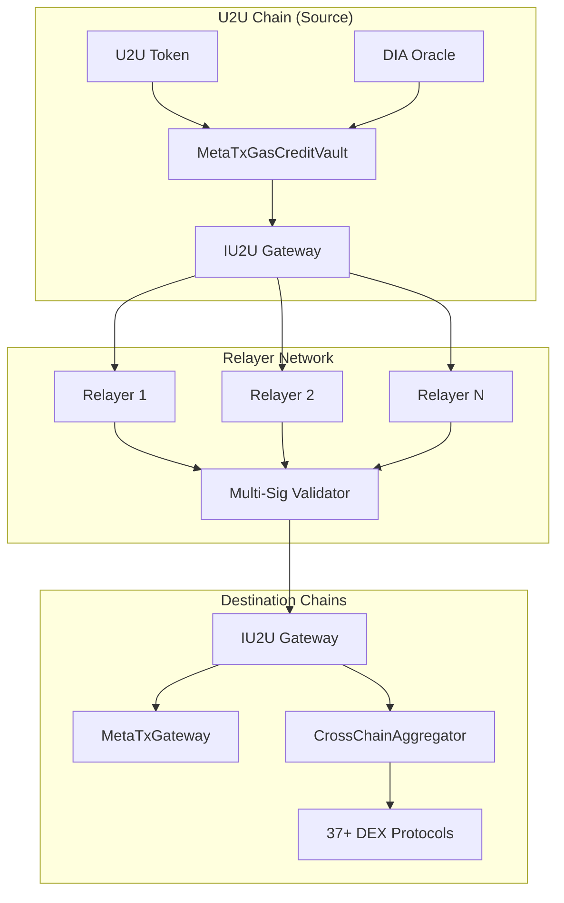

<div align="center">
    <a href="https://dinetwork.xyz">
        
    </a>
</div>

## IU2U Protocol Open Source Projects
We are committed to **open-source development** and actively contribute to building a robust **cross-chain ecosystem**. Here's what you'll find in our repositories:

### 🔗 Core Smart Contracts ([IU2U-Contracts](https://github.com/DINetworks/DI-U2U-Contracts))
- **IU2U.sol** – Main gateway contract handling GMP and U2U↔IU2U conversion (1:1 ratio)
- **IU2UExecutable.sol** – Base contract for dApps receiving cross-chain calls
- **CrossChainAggregator.sol** – Multi-protocol DEX aggregation supporting 37+ protocols
- **MetaTxGasCreditVault.sol** – Gas credit management on U2U chain
- **MetaTxGateway.sol** – Meta-transaction execution on destination chains
- **MulticallLibraryV2.sol** – Batch operations and optimal routing
- **QuoteLibrary.sol** – Price quotation for DEX protocols

### 🌐 Supported Networks & Deployment
| Network | Chain ID | Status | Gateway Contract |
|---------|----------|--------|------------------|
| U2U | 2484 (Testnet) / 39 (Mainnet) | ✅ Native | IU2U Gateway + Vault + MetaTx |
| Ethereum | 1 | ✅ Live | IU2U Gateway + MetaTx |
| BSC | 56 | ✅ Live | IU2U Gateway + MetaTx |
| Polygon | 137 | ✅ Live | IU2U Gateway + MetaTx |
| Avalanche | 43114 | ✅ Live | IU2U Gateway + MetaTx |
| Arbitrum | 42161 | ✅ Live | IU2U Gateway + MetaTx |
| Optimism | 10 | ✅ Live | IU2U Gateway + MetaTx |
| Base | 8453 | ✅ Live | IU2U Gateway + MetaTx |

### 💻 SDK & Developer Integration
- **Contract Interfaces** – IIU2UGateway for seamless integration
- **Deployment Scripts** – Automated deployment across all supported chains
- **Integration Examples** – DeFi protocols, cross-chain bridges, meta-transaction implementations
- **Testing Framework** – Comprehensive test suite with cross-chain simulations

### 🚀 Relayer Infrastructure
- **GMP Relayer** – Cross-chain message passing coordination
- **Meta-Transaction Relayer** – Gasless transaction execution
- **Multi-signature Validation** – Decentralized relayer network security
- **Monitoring & Health Checks** – Real-time system status and alerting

## 🚀 Welcome to IU2U Protocol
IU2U Protocol is dedicated to building next-generation cross-chain interoperability solutions using the **Interoperable U2U (IU2U) Protocol**. Our mission is to enable seamless, gas-efficient, and highly programmable cross-chain transactions, driving adoption and utility for **U2U**, the native token of the **U2U Chain**.

## 🌉 What is IU2U Protocol?
The **Interoperable U2U (IU2U) Protocol** is a cutting-edge solution that enhances **U2U Chain's** interoperability, enabling seamless asset transfers, smart contract execution, and data messaging across multiple blockchain ecosystems.

### 🌟 Key Features

### 1️⃣ **Gasless Meta-Transaction System (U2U as Primary Gas Token)**
- Users pay gas fees exclusively in **U2U**, regardless of the blockchain they interact with.
- Supports **Ethereum, BNB Chain, Polygon, Optimism, Base, and any EVM-compatible chain**.
- Simplifies user experience by abstracting gas fees and reducing transaction friction.

### 2️⃣ **Enhanced U2U Interoperability (Replacing WU2U)**
- Eliminates the need for **wrapped U2U (WU2U)** by introducing a **native cross-chain U2U token**.
- Enables **data transmission** and **smart contract execution** alongside asset transfers.
- Expands **U2U’s programmability** across different chains, making it more developer-friendly.

### 3️⃣ **Cross-Chain Swap Powered by U2U**
- **DEX Aggregator & Liquidity Router** ensures the most efficient swaps using **U2U for gas**.
- **Gas Fee Abstraction:**
  - Off-chain transaction signing to reduce gas costs.
  - Automatic **U2U Gas Conversion** where required.
  - **Meta-Transaction Relayer** executes transactions on behalf of users.

### 4️⃣ **Cross-Chain Bridge & General Message Passing (U2U-Based)**
- Supports advanced cross-chain **token transfers**, **data transmission**, and **smart contract interactions**.
- **Cross-Chain Smart Contract Calls** allow contracts on one chain to trigger actions on another.
- Future support for **non-EVM blockchains** to expand the IU2U ecosystem.

### 5️⃣ **High-Performance Optimization**
- **Routing Algorithm** finds optimal paths for cost-effective swaps.
- **Batch Transactions** reduce fees by bundling multiple operations.
- **Dynamic Fee Structure** optimizes gas costs to encourage frequent transactions.

## 🏗️ Technical Architecture

### Core System Components



### 🔧 Smart Contract Architecture

#### 1. **IU2U Gateway Contract** (`IU2U.sol`)
**Core Functions:**
- `deposit()` - Convert U2U to IU2U (1:1 ratio) on U2U chain
- `withdraw(amount)` - Convert IU2U back to U2U on U2U chain
- `callContract()` - Execute cross-chain contract calls
- `callContractWithToken()` - Execute cross-chain calls with token transfer
- `sendToken()` - Simple cross-chain token transfers
- `execute()` - Process relayer-submitted cross-chain commands

**Security Features:**
- Multi-signature relayer validation
- Command replay protection
- Payload hash verification
- Whitelisted relayer system

#### 2. **Meta-Transaction System**
**MetaTxGasCreditVault** (U2U Chain):
- `depositCredits()` - Deposit IU2U for gas credits
- `withdrawCredits()` - Withdraw unused gas credits
- `consumeCredits()` - Deduct gas costs from user balance
- DIA Oracle integration for real-time gas price conversion

**MetaTxGateway** (Destination Chains):
- `executeMetaTransaction()` - Execute gasless transactions
- `batchExecuteMetaTransactions()` - Batch execution for efficiency
- EIP-712 signature validation
- Nonce management and replay protection

#### 3. **Cross-Chain DEX Aggregation**
**Supported Protocols (37+):**
- **V2 AMMs**: Uniswap V2, SushiSwap, PancakeSwap, TraderJoe, etc.
- **V3 Concentrated Liquidity**: Uniswap V3, SushiSwap V3, PancakeSwap V3
- **Stableswap**: Curve, Ellipsis, Solidly forks
- **Specialized**: Balancer, 1inch, Kyber Network, GMX, WOOFi

**Routing Features:**
- Multi-DEX optimal path finding
- Gas-optimized execution
- Slippage protection
- MEV resistance

### 🔗 Integration Patterns

#### For DeFi Protocols:
```solidity
contract MyDeFiProtocol is IU2UExecutable {
    constructor(address gateway_) IU2UExecutable(gateway_) {}
    
    function _execute(
        string calldata sourceChain,
        string calldata sourceAddress,
        bytes calldata payload
    ) internal override {
        // Process cross-chain DeFi operation
    }
}
```

#### For Cross-Chain Swaps:
```javascript
// Execute cross-chain swap
await iu2uGateway.executeSwap({
    tokenIn: USDC_ADDRESS,
    tokenOut: WETH_ADDRESS,
    amountIn: ethers.utils.parseUnits("1000", 6),
    minAmountOut: minOutput,
    routerType: 0, // Uniswap V2
    to: userAddress,
    deadline: deadline,
    swapData: "0x"
});
```

## 🔥 Use Cases & Ecosystem Expansion
The **IU2U Protocol** serves as the foundation for **next-generation cross-chain DApps**, including:

- **🚀 Cross-Chain DEX Aggregators & Swap Platforms**
- **💰 Cross-Chain Lending & Borrowing Protocols**
- **📊 Multi-Chain Liquidity Provisioning & Yield Aggregation**
- **🔗 Cross-Chain Staking & Yield Farming**
- **📡 Decentralized Cross-Chain Messaging & Smart Contract Execution**

## 📈 Why IU2U Matters for U2U
By implementing **IU2U**, **U2U Chain** will establish itself as a leader in **blockchain interoperability**, significantly increasing **U2U’s real-world utility** while driving network adoption and growth.

## 📜 IU2U Labs Open Source Projects
We are committed to **open-source development** and actively contribute to building a robust **cross-chain ecosystem**. Here’s what you’ll find in our repositories:

- **🔗 IU2U.sol & IU2UGateway.sol** – Core smart contracts for IU2U interoperability.
- **💻 SDKs & Developer Tools** – Libraries and APIs for seamless integration.
- **🚀 Relayer Infrastructure** – Gasless transaction relayer implementation.
- **📡 Bridge & Message Passing Protocols** – Enabling cross-chain interactions. 
- **📊 DEX Aggregation & Liquidity Routing** – Efficient U2U-powered trading solutions.

## Open Source Repository

- **Smart Contracts**: [https://github.com/DINetworks/DI-U2U-Contracts](https://github.com/DINetworks/DI-U2U-Contracts)
- **Frontend**: [https://github.com/DINetworks/DI-U2U](https://github.com/DINetworks/DI-U2U)
- **MetaTxRelayer**: [https://github.com/DINetworks/MetaTx-Contracts](https://github.com/DINetworks/MetaTx-Relayer)

- **GMP Relayer**: [https://github.com/DINetworks/DI-U2U-Contracts/tree/main/relayer](https://github.com/DINetworks/DI-U2U-Contracts/tree/main/relayer)

## � Quick Start & Deployment

### Prerequisites
- **Node.js** >= 18.0.0
- **Hardhat** development framework
- **Funded wallets** on target chains
- **RPC endpoints** for all supported networks

### Contract Deployment

#### 1. Environment Setup
```bash
# Clone the contracts repository
git clone https://github.com/DINetworks/DI-U2U-Contracts.git
cd DI-U2U-Contracts

# Install dependencies
npm install
cd relayer && npm install && cd ..

# Configure environment
cp .env.example .env
# Edit .env with your private keys and RPC URLs
```

#### 2. Network Configuration
```javascript
// hardhat.config.js
networks: {
  u2u: {
    chainId: 2484, // 39 for mainnet
    url: "https://rpc.testnet.ms",
    accounts: [process.env.PRIVATE_KEY]
  },
  ethereum: {
    chainId: 1,
    url: process.env.ETHEREUM_RPC,
    accounts: [process.env.PRIVATE_KEY]
  }
  // ... other networks
}
```

#### 3. Deploy Core Contracts
```bash
# Deploy on U2U (Gateway + Vault)
npx hardhat run scripts/deploy-gmp.js --network u2u
npx hardhat run scripts/deploy-meta-tx.js --network u2u

# Deploy on other chains (Gateway + MetaTx)
npx hardhat run scripts/deploy-gmp.js --network ethereum
npx hardhat run scripts/deploy-meta-tx.js --network ethereum
```

### Relayer Setup

#### GMP Relayer Configuration
```json
{
  "relayerPrivateKey": "0x...",
  "chains": {
    "u2u": {
      "rpc": "https://rpc.testnet.ms",
      "iu2uAddress": "0x...",
      "startBlock": 1000000
    },
    "ethereum": {
      "rpc": "https://mainnet.infura.io/v3/YOUR_KEY",
      "iu2uAddress": "0x...",
      "startBlock": 18500000
    }
  }
}
```

#### Start Relayer Services
```bash
# Start GMP relayer
cd relayer
node IU2URelayer.js

# Start Meta-Transaction relayer (separate terminal)
node MetaTxRelayer.js
```

### Integration Examples

#### Smart Contract Integration
```solidity
import "@iu2u/contracts/interfaces/IIU2UGateway.sol";

contract MyContract {
    IIU2UGateway public iu2uGateway;
    
    constructor(address _gateway) {
        iu2uGateway = IIU2UGateway(_gateway);
    }
    
    function sendCrossChain(
        string memory destinationChain,
        string memory contractAddress,
        bytes memory payload
    ) external {
        iu2uGateway.callContract(
            destinationChain,
            contractAddress,
            payload
        );
    }
}
```

#### Frontend Integration
```javascript
import { ethers } from 'ethers';
import { IU2UProvider } from '@iu2u/sdk';

// Initialize IU2U provider
const iu2u = new IU2UProvider({
  rpcs: {
    u2u: 'https://rpc.testnet.ms',
    ethereum: 'https://mainnet.infura.io/v3/KEY'
  },
  contracts: {
    u2u: '0x...',
    ethereum: '0x...'
  }
});

// Deposit U2U for gasless transactions
await iu2u.deposit('100'); // 100 U2U

// Execute cross-chain transaction
await iu2u.callContract(
  'ethereum',
  '0xTargetContract',
  '0xPayloadData'
);
```

## 🌐 Network Support & Contract Addresses

### Mainnet Deployments
| Network | Chain ID | IU2U Gateway | MetaTx Gateway | Aggregator |
|---------|----------|--------------|----------------|------------|
| U2U | 39 | `0x560d354E9f690f9749594840120B4b5903c20E07` | `0xbee9591415128F7d52279C8df327614d8fD8a9b2` | `0x...` |
| Ethereum | 1 | `0x...` | `0xbee9591415128F7d52279C8df327614d8fD8a9b2` | `0x...` |
| BSC | 56 | `0xe4A31447871c39eD854279acCEAeB023e79dDCC5` | `0xbee9591415128F7d52279C8df327614d8fD8a9b2` | `0x...` |
| Polygon | 137 | `0xe5DE1F17974B1758703C4bF9a8885F7e24983bb7` | `0xbee9591415128F7d52279C8df327614d8fD8a9b2` | `0x...` |
| Avalanche | 43114 | `0x2e33C951e4cdDbccB5945C9f32095FccD1171259` | `0xbee9591415128F7d52279C8df327614d8fD8a9b2` | `0x...` |
| Arbitrum | 42161 | `0x9E5e98FFaD3F779Ed3459631694788E38B822261` | `0xbee9591415128F7d52279C8df327614d8fD8a9b2` | `0x...` |
| Optimism | 10 | `0xeD93D637b13Ca7f61875BB31386E9a54Bab51C9B` | `0xbee9591415128F7d52279C8df327614d8fD8a9b2` | `0x...` |
| Base | 8453 | `0x9649a304bD0cd3c4dbe72116199990df06d87329` | `0xbee9591415128F7d52279C8df327614d8fD8a9b2` | `0x...` |

*Note: Actual contract addresses are available in the [IU2U-Contracts repository deployment files](https://github.com/DINetworks/IU2U-Contracts/tree/main/deployments).*

### Testnet Deployments
| Network | Chain ID | Status | Purpose |
|---------|----------|--------|---------|
| U2U Testnet | 2484 | ✅ Active | Development & Testing |

## �📌 Join Us
🚀 **IU2U Labs** is actively seeking **developers, researchers, and contributors** passionate about building the future of cross-chain finance. Get involved!

### 🌐 Official Links
- **Website:** [https://iu2u.fi](https://iu2u.fi)
- **Smart Contracts:** [https://github.com/DINetworks/IU2U-Contracts](https://github.com/DINetworks/IU2U-Contracts)
- **Technical Documentation:** [IU2U Technical Docs](https://docs.iu2u.fi)
- **API Reference:** [Contract API Reference](https://github.com/DINetworks/IU2U-Contracts/blob/main/API_REFERENCE.md)
- **Deployment Guide:** [Deployment Instructions](https://github.com/DINetworks/IU2U-Contracts/blob/main/DEPLOYMENT_GUIDE.md)

### 📚 Developer Resources
- **Integration Guide:** [Smart Contract Integration](https://github.com/DINetworks/IU2U-Contracts/blob/main/docs/guides/smart-contract-integration.md)
- **Frontend Examples:** [Frontend Integration Guide](https://github.com/DINetworks/IU2U-Contracts/blob/main/docs/guides/frontend-integration.md)
- **Core Concepts:** [Cross-Chain Architecture](https://github.com/DINetworks/IU2U-Contracts/blob/main/docs/core-concepts/cross-chain-architecture.md)
- **IU2U Token Documentation:** [Token Specifications](https://github.com/DINetworks/IU2U-Contracts/blob/main/docs/core-concepts/iu2u-token.md)

### 💬 Community & Support
- **Twitter:** [--](#)
- **Discord:** [--](#)
- **GitHub Issues:** [Report Bugs & Feature Requests](https://github.com/DINetworks/IU2U-Contracts/issues)
- **Developer Support:** support@iu2u.com

### 🔧 Development Tools
- **Solidity Version:** 0.8.24
- **Framework:** Hardhat v2.22.19
- **Security:** OpenZeppelin Contracts v5.2.0
- **Oracles:** DIA Oracle integration
- **Testing:** Comprehensive test suite with cross-chain simulations

📢 Stay tuned for updates, and let’s build the future of **cross-chain interoperability** together! 🔥

