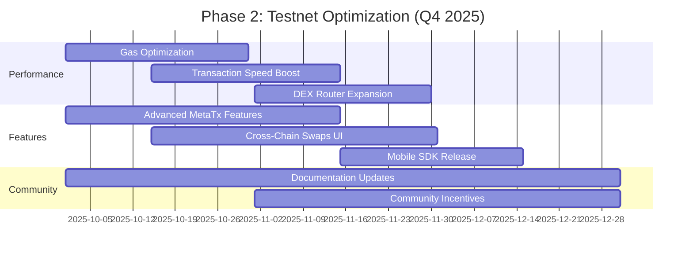
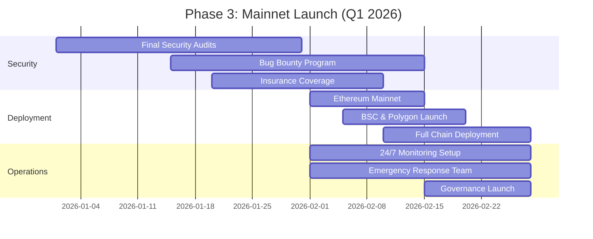
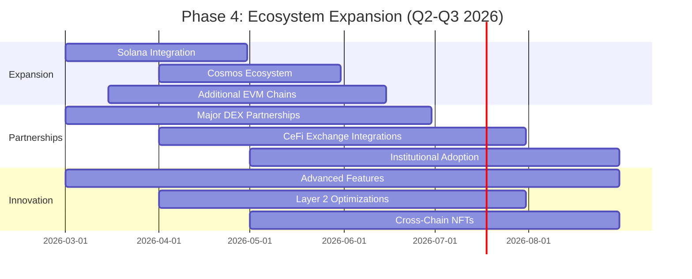
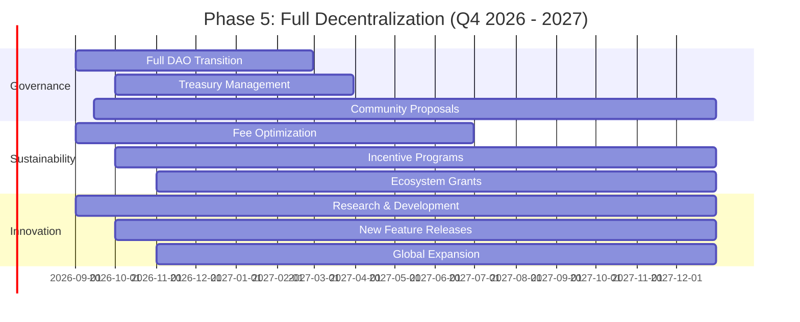

# IU2U Protocol Roadmap

    

## Overview

IU2U Protocol is a comprehensive cross-chain infrastructure that enables seamless token transfers, DEX aggregation, and gasless transactions across multiple EVM-compatible blockchains. This roadmap outlines our development journey from testnet launch to full ecosystem maturity.

## Current Status (Phase 1: Foundation - ✅ Completed)

### ✅ Core Infrastructure Delivered
- **IU2U Gateway**: Cross-chain token bridge with 1:1 U2U backing
- **Meta Transaction System**: Gasless transactions via EIP-712 signatures and multi-token credits
- **DEX Aggregation**: Support for 37+ DEX protocols with optimal routing
- **Relayer Network**: Decentralized message passing and validation
- **Testnet Deployment**: Live on U2U Nebulas Testnet (Chain ID: 2484)

### ✅ Technical Achievements
- 8 production-ready smart contracts
- Comprehensive security audits and testing
- Frontend SDK with Wagmi integration
- Relayer infrastructure with health monitoring
- Complete technical documentation

## Phase 2: Testnet Optimization (Q4 2025)

### 🎯 Objectives
- Enhance user experience and system reliability
- Expand DEX protocol support
- Optimize gas efficiency and transaction speeds
- Build developer community and tooling

### 📅 Timeline

### 🚀 Key Deliverables
- **Performance Improvements**: 50% faster cross-chain transactions
- **Enhanced DEX Support**: 50+ additional protocols
- **Developer Tools**: Mobile SDK and advanced APIs
- **Community Growth**: 1000+ active developers

## Phase 3: Mainnet Launch (Q1 2026)

### 🎯 Objectives
- Secure mainnet deployment across all supported chains
- Establish production-grade infrastructure
- Launch governance and tokenomics
- Achieve market adoption milestones

### 📅 Timeline

### 🚀 Key Deliverables
- **Multi-Chain Mainnet**: Live on all 8 supported networks
- **Production Infrastructure**: Enterprise-grade monitoring and security
- **Governance System**: Community-driven protocol upgrades
- **Market Adoption**: $10M+ TVL and 10,000+ daily transactions

## Phase 4: Ecosystem Expansion (Q2-Q3 2026)

### 🎯 Objectives
- Expand to additional blockchain networks
- Deepen DeFi integrations
- Launch advanced features and products
- Achieve significant market share

### 📅 Timeline

### 🚀 Key Deliverables
- **Network Expansion**: Support for 15+ blockchain networks
- **Strategic Partnerships**: Integration with top 10 DEXs and exchanges
- **Advanced Features**: Cross-chain NFTs, yield farming, lending protocols
- **Market Leadership**: $100M+ TVL and industry recognition

## Phase 5: Full Decentralization (Q4 2026 - 2027)

### 🎯 Objectives
- Complete decentralization of protocol governance
- Achieve self-sustaining ecosystem
- Global adoption and mainstream usage
- Continuous innovation and evolution

### 📅 Timeline

### 🚀 Key Deliverables
- **Complete Decentralization**: 100% community-governed protocol
- **Sustainable Economics**: Self-funded development and growth
- **Global Adoption**: Millions of users across 20+ countries
- **Innovation Hub**: Leading cross-chain infrastructure provider

## Success Metrics

### 📊 Quantitative Targets
- **Q4 2025**: 1,000 testnet users, 10 partner protocols
- **Q1 2026**: $1M TVL, 50,000 transactions/month
- **Q2 2026**: $10M TVL, 500,000 transactions/month
- **Q3 2026**: $50M TVL, 2M transactions/month
- **2027**: $500M+ TVL, 10M+ transactions/month

### 🎯 Qualitative Achievements
- **Industry Recognition**: Featured in top blockchain publications
- **Developer Adoption**: 10,000+ active developers
- **Institutional Trust**: Audited by top 3 security firms
- **Community Strength**: 100,000+ community members
- **Innovation Leadership**: Patents and industry standards

## Risk Mitigation

### 🔒 Technical Risks
- **Security**: Multiple audit rounds and bug bounties
- **Scalability**: Performance monitoring and optimization
- **Compatibility**: Extensive testing across all supported chains

### 📈 Market Risks
- **Competition**: Continuous innovation and partnerships
- **Adoption**: Developer incentives and marketing campaigns
- **Regulation**: Compliance monitoring and legal expertise

### 🤝 Operational Risks
- **Team**: Succession planning and knowledge transfer
- **Funding**: Diverse revenue streams and treasury management
- **Community**: Transparent communication and governance

## Get Involved

### 👥 For Developers
- Join our testnet program
- Contribute to open-source repositories
- Participate in hackathons and bounties

### 🤝 For Partners
- Explore integration opportunities
- Join our partner program
- Collaborate on cross-chain solutions

### 🌐 For Users
- Start with testnet transactions
- Provide feedback and suggestions
- Join community discussions

---

**IU2U Protocol Roadmap - Last Updated: September 29, 2025**

*This roadmap represents our current development plans and may be adjusted based on community feedback, technical challenges, and market conditions.*
